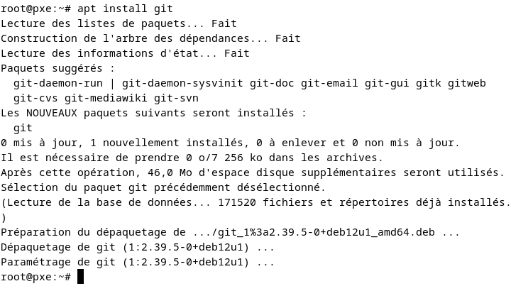
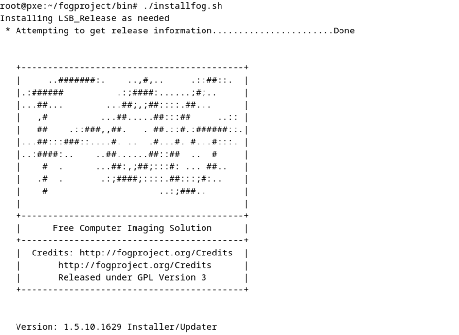
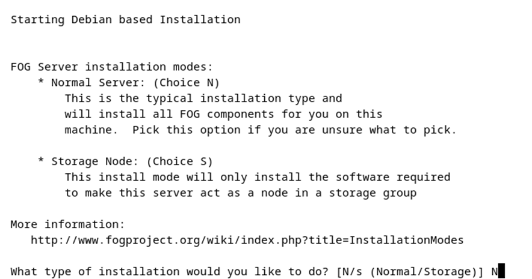
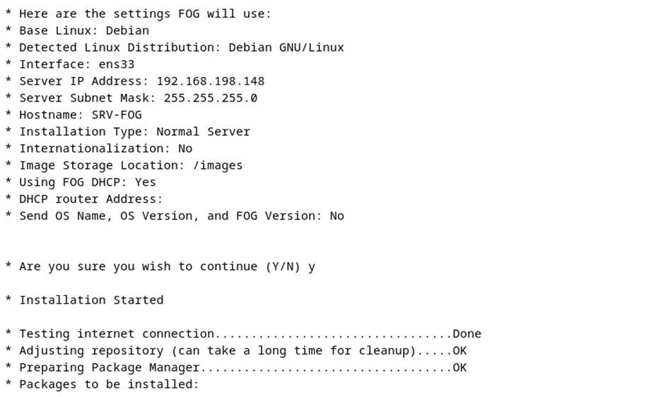

# Guide d'installation de FOG sur Debian/Ubuntu

Ce tutoriel présente les étapes pour installer et configurer **FOG**, un logiciel open-source utilisé pour déployer des systèmes d'exploitation sur plusieurs ordinateurs à la fois via le réseau. Le serveur FOG va permettre de faciliter les déploiementS, la gestion des machines à distance, sans avoir besoin de supports physiques comme des clés USB ou des CD.

**FOG** utilise la technologie **PXE** (Preboot eXecution Environment), qui permet aux ordinateurs de démarrer directement depuis le réseau. Ce processus permet aux machines de se connecter à un serveur FOG, de télécharger une image système et de l'installer automatiquement. Ainsi, il devient possible d'installer ou de réinstaller des systèmes d'exploitation sur plusieurs ordinateurs simultanément, ce qui est particulièrement utile dans les environnements professionnels ou éducatifs.


## Prérequis

Avant de commencer, assurez-vous d'avoir :

- Une machine sans image avec une carte configuré en mode LAN segment X.
- une machine sous linux avec 2 cartes réseau (machine master), l'une permettant d'accéder à internet(NAT) et l'autre permettant de communiquer avec les machines cibles dans le réseau interne (LAN segment X).
- Un serveur DHCP fonctionnel (sous Windows ou Linux).
- Logiciel VMware pour héberger les machines virtuelles.
- Toutes les machines doivent disposées des des privilèges root.
- Un proxy serveur configuré sur votre machine contenant votre serveur FOG (je partagerais les paramètres utlérieurement)


## Étape 1 : Mise à jour des paquets

Commencer par mettre à jour le système pour s'assurer que tous les paquets sont à jour :

```bash
sudo apt update && sudo apt upgrade 
```

## Étape 2 : Installer les dépendances nécessaires

Installer git sur votre machine pour pouvoir ensuite cloner le dépôt git de FOG.

```bash
sudo apt install git
```



## Étape 3 : Cloner le dépôt FOG 


Cloner les fichiers à partir du dépôt officiel de FOG pour obtenir les derniers configuration de FOG.

```bash
cd /root
git clone https://github.com/FOGProject/fogproject.git
```


## Étape 4 : Lancement de l'installation

Cela télécharge FOG dans le répertoire `/root/fogproject`.

Maintenant, lancer l'installation : 

```bash
cd fogproject/bin
./install.sh
```


## Étape 5 : Personnalisation du serveur FOG avant installation 

Lors de l'installation de **FOG**, plusieurs questions seront posées, il faudra y répondre en fonction de vos besoins spécifiques.

### **1. Version de Linux**


- **Réponse** : 2
- **Description** : Cette question demande de spécifier la distribution Linux sur laquelle FOG sera installé. 


### 2. **Type d'installation**



- **Réponse** : N
- **Explication** :  Cette question vous demande de choisir le mode d'installation pour le serveur FOG. Il existe deux options principales :
        -> Normal Server (N) : Il s'agit du mode d'installation standard, qui installe tous les composants nécessaires de FOG sur le serveur. Ce mode est recommandé si vous n'êtes pas sûr de l'option à choisir.
        -> Storage Node (S) : Ce mode est destiné à installer uniquement les logiciels nécessaires pour que ce serveur agisse comme un nœud dans un groupe de stockage. Ce choix est utilisé si vous souhaitez configurer un serveur uniquement pour stocker des images et non pour gérer le déploiement ou d'autres alt text]services.


### 3. **Interface réseau par défaut**


- **Réponse** : Y / ens37 (réseau local)
- **Explication** : Le script détecte les interfaces réseau disponibles sur votre système et vous demande si vous souhaitez changer l'interface par défaut utilisée pour la communication avec le serveur FOG. Par exemple, dans ce cas, l'interface `ens33` est utilisée par défaut.
  - **Si vous souhaitez conserver l'interface par défaut** pour la configuration de FOG, répondez `N`.
  - **Si vous devez utiliser une autre interface**, vous devez répondre `Y` et entrer le nom de l'interface souhaitée.


### 4. **Serveur DHCP**


#### **Adresse du routeur**
---
- **Question** : "Would you like to setup a router address for the DHCP server ?"
- **Réponse** : N
- **Explication** : Si la machine hébergeant votre serveur FOG ne dispose pas d'un accès internet, il faut lui donner la route par défaut à rejoindre pour l'accès internet. Dans notre cas, notre machine dispose déjà d'une carte réseau en mode NAT pour l'accès internet.


#### **Serveur DNS**
-------
- **Question** : "Would you like DHCP to handle DNS ?"
- **Réponse** : N
- **Explication** : Cette question demande si le serveur DHCP gérera également le DNS. Si vous préférez spécifier un serveur DNS séparé, tapez `N`. Sinon, tapez `Y`.


#### **Serveur DHCP**
------
- **Question** : "Would you like to use the FOG server for DHCP service ?"
- **Réponse** : N
- **Explication** : Vous pouvez utiliser le serveur FOG comme serveur DHCP aussi. Si vous n'avez pas un serveur DHCP déjà existant, tapez `Y` pour activer ce service. Si vous avez un serveur DHCP externe, tapez `N`.

### 5. **Packs de langues supplémentaires**


- **Réponse** : N
- **Explication** : Cette question vous propose d'installer des packs de langues supplémentaires pour FOG. Si vous n'en avez pas besoin, tapez `N`.

### 6. **HTTPS pour le serveur FOG**


- **Réponse** : Y
- **Explication** : Cette question vous demande si vous souhaitez activer HTTPS pour sécuriser l'accès au serveur FOG. 

### 7. **Nom du serveur**


- **Réponse** : Y
- **Explication** : cette question vous sert à si vous le souhaitez changer le nom du serveur. Si vous êtes satisfait du nom par défaut, tapez `N`.

### 8. **Accepter l'envoi d'informations anonymes**


- **Réponse** : N
- **Explication** : FOG vous demande si vous êtes d'accord pour envoyer des informations anonymes à des fins d'amélioration du logiciel. Tapez `N` si vous préférez ne pas envoyer d'informations.

## Étape 6 : Vérifier les paramètres séléctionnées

Avant de passer à la configuration finale, le script affiche un récapitulatif des paramètres sélectionnés.



Prenez un moment pour vérifier que toutes ces informations correspondent bien à votre environnement réseau. Une fois validées, le script continue automatiquement.

### Étape 7 : Configuration de la base de données

Une fois les questions de configuration terminées, le script lance l’installation des services essentiels comme Apache, MySQL. À la fin, une URL est affichée :


Ouvrez votre navigateur et avec l’URL fournie. Une page d’accueil s’affiche vous invitant à cliquer sur **"Install/Update Now"**.Cette action met à jour  la base de données MySQL en créant les tables nécessaires.

### Etape 8 : Finalisation de l'installation de FOG

Une fois terminé, retourner dans le terminal. Appuyez sur **Entrée** dans le terminal pour que les services soit activés et démarrés automatiquement. Cette étape est également essentielle pour pouvoir obtenir le menu de démarrage dont nous reparlerons par la suite. 


